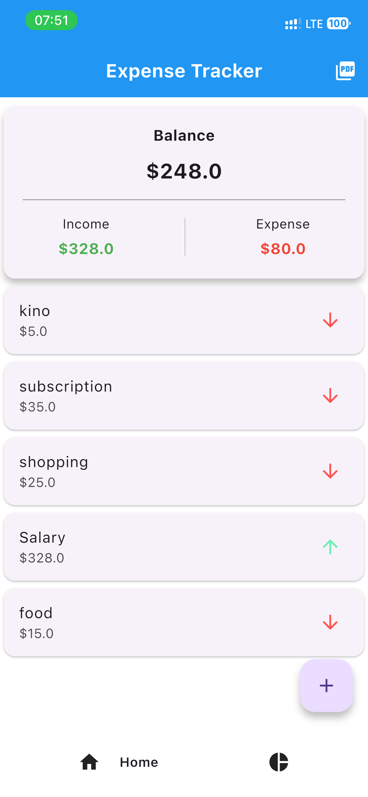
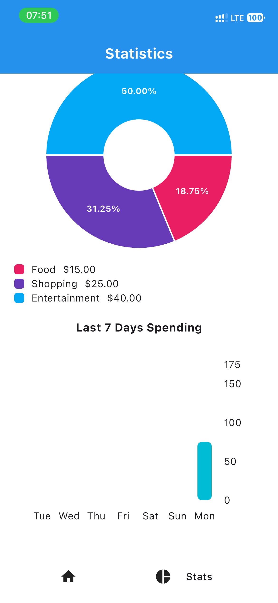
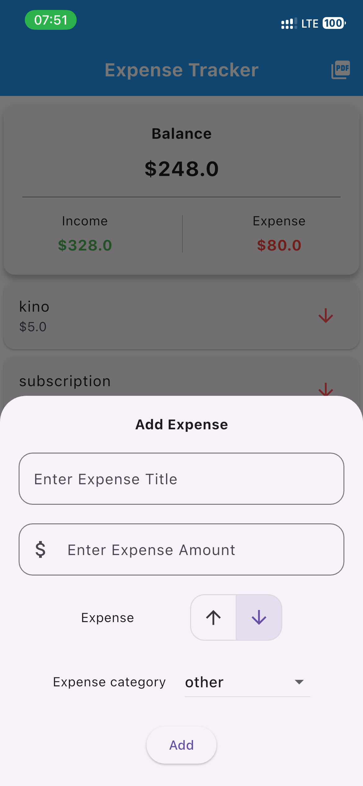

# Expense Tracker 

A personal finance app built with Flutter to track income and expenses.

## Features

- Add income and expense transactions
- Category-based organization
- Visual statistics with pie and bar charts
- PDF export of transaction history
- Dark mode support
- Swipe to delete transactions

## Tech Stack

- **Flutter** — cross-platform mobile development
- **Isar DB** — local database
- **fl_chart** — pie and bar charts
- **pdf & printing** — PDF export
- **Riverpod** — state management
- **intl** — date and number formatting

## Getting Started

```bash
git clone https://github.com/USERNAME/expense_tracker.git
cd expense_tracker
flutter pub get
flutter run
```

## Screenshots

<p float="left">
  
  
  
</p>

## Author

Made by **Mukhammademin** — learning Flutter one commit at a time
